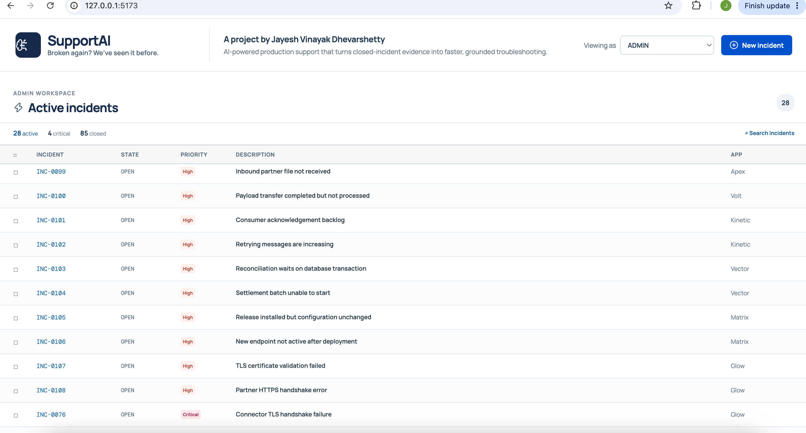
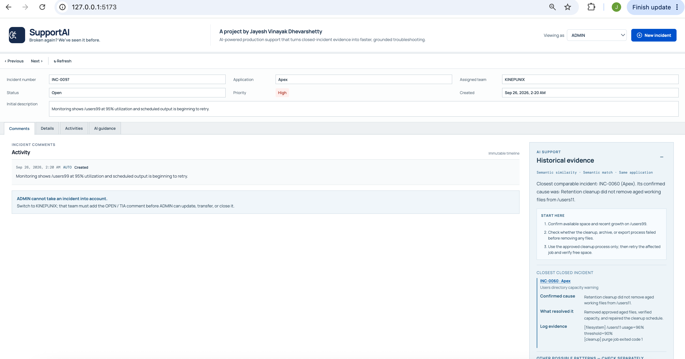

# SupportAI

### Broken again? We have seen it before.

I made SupportAI because I saw this problem in production support. When an incident comes, people search old tickets, read many comments, ask different teams what happened before, and still may not know what to do next.

## A real problem behind this project

One time I was getting repeated **Application Down** incidents. Every time we checked, the application was working. I looked at old incidents and saw that they were happening after the nightly restart.

The application was not actually down. The monitoring script was checking the application 5 seconds after startup, but the application needed more time to become ready. We changed the delay from 5 seconds to 15 seconds. After that, the false alerts stopped.

Later, the same issue can come with a different title like **URL not responding** or **application crashed**. Without a tool, someone may not connect it with the old fix. They start checking from zero again. This is why I made SupportAI.

## My idea

When an incident is created, SupportAI keeps the title, application, and first description. When it is closed, it keeps only the final closing comment. That comment has the cause, impact, actions, and useful logs.

It does **not** send every update, transfer comment, or long team discussion to AI. Keeping only the useful parts means less data to store, less data for AI to search, lower cost later, and faster results.

SupportAI uses RAG to compare a new issue with old closed incidents. It can understand that **Application Down** and **URL not responding** can be about a similar issue even when the words are different. Then it shows the old incident number, what caused it, what fixed it, and the logs that helped us understand it.

## How it works

```text
New incident
     ↓
Title + application + initial description
     ↓
Exact title search first
     ↓
Semantic RAG search if the title is different
     ↓
Relevant closed-incident evidence
     ↓
Start-here checks + previous cause + resolution + log evidence
```

SupportAI gives more importance to the incident title and initial alert when matching. The final closing comment is used as supporting evidence after a relevant incident is found. It does not replace the support engineer. It gives the engineer a better starting point instead of making them search from zero.

## What AI can and cannot use

| Ticket information | Visible in the ticket | Used by RAG |
| --- | --- | --- |
| Initial incident description | Yes | Yes |
| OPEN/TIA, update, and transfer comments | Yes | No |
| Final closing comment | Yes | Yes |
| Cause, impact, actions, and logs written in the closing comment | Yes | Yes |

This means normal discussion can stay in the ticket, while RAG only learns from the original issue and final resolution. It reduces unnecessary data stored for AI retrieval and keeps the answer focused on evidence that helped close the incident.

## Main features

- Incident queues for VEXCAPUNIX, LEXIXUNIX, MARCAPUNIX, KINEPUNIX, and ADMIN.
- Create, OPEN/TIA, update, transfer, close, and reopen workflows with an immutable timeline.
- Active incidents, closed incidents, and a separate search view.
- RAG guidance shows the following
  - **Start here** checks for the current incident
  - The closest matching closed incident
  - Its confirmed cause, previous resolution, and relevant logs
  - Other possible patterns kept separate, so different causes are not mixed together
- Clickable incident references and in-app incident tabs, so engineers can inspect historical tickets without losing the incident they are working on.
- Local Ollama embeddings and local caching, so incident data stays on the machine.

## Screenshots

### Incident queue



### AI evidence for an open incident



## Demo examples

The project includes synthetic closed incidents and active test tickets for common production-support situations such as

- Filesystem capacity and `/users` mount issues
- Inbound files, CFT/SFTP transfers, and delayed payloads
- MQ consumers, acknowledgements, retry queues, and channels
- Database locks and batch jobs
- Deployments and configuration problems
- TLS certificate, trust-store, hostname, and expiry failures
- Application availability alerts after restarts

Try opening **INC-0111** or **INC-0112**. Their titles are different from the closed ticket **INC-0109**, but SupportAI can still retrieve the previous application-availability investigation through semantic matching.

## Run locally

Install the frontend and backend dependencies once.

```bash
npm install
python3 -m venv backend/.venv
backend/.venv/bin/pip install -r backend/requirements.txt
```

Start the backend in one terminal.

```bash
cd backend
./.venv/bin/uvicorn app:app --host 127.0.0.1 --port 8000
```

Start Ollama in a second terminal.

```bash
ollama pull nomic-embed-text
ollama serve
```

Start the frontend in a third terminal.

```bash
npm run dev
```

Open [http://127.0.0.1:5173](http://127.0.0.1:5173).

## Tech used

- React and Vite for the interface
- FastAPI and SQLite for the backend and local ticket storage
- Ollama with `nomic-embed-text` for local semantic embeddings
- Retrieval-Augmented Generation (RAG) for incident matching and grounded evidence

## Test

```bash
PYTHONPATH=backend backend/.venv/bin/python backend/test_api.py
```

All example incidents in this project are synthetic and created only for testing and demonstration.
